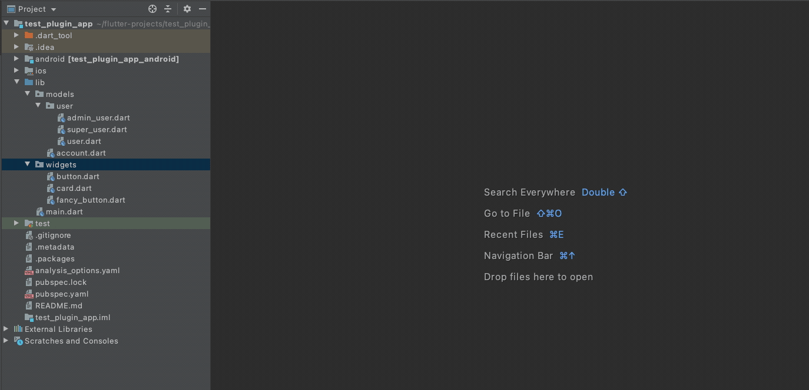
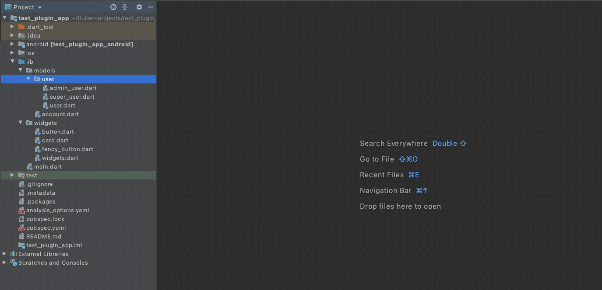
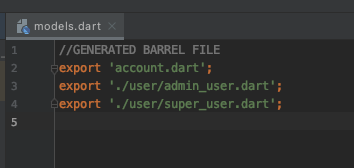
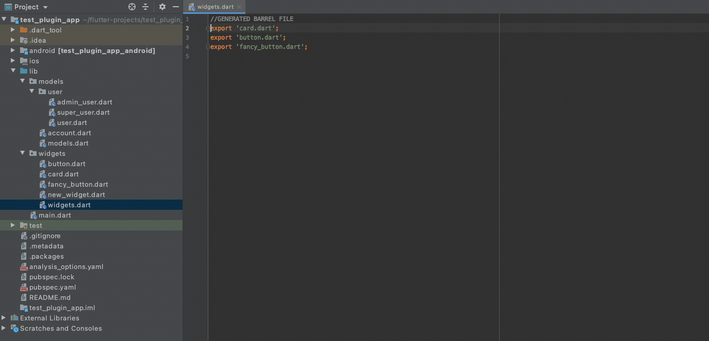
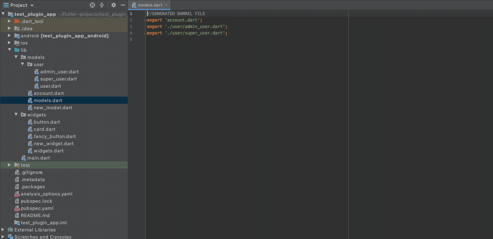
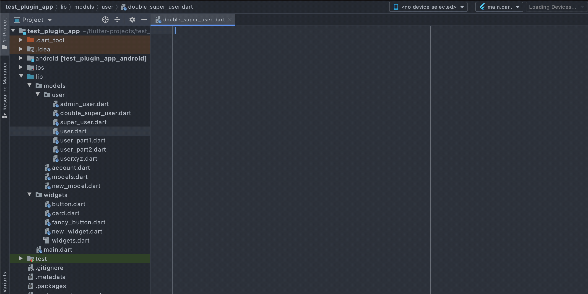
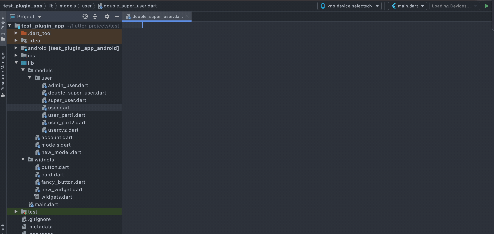

# Dart Barrel File
<!-- Plugin description -->
This plugin is created for those that like to create and use barrel files to ease the importing and exporting of dart files.

The plugin will generate a barrel file for all dart files in one directory.  Optionally, it will traverse the subdirectory tree to include all dart files in subdirectories.

A selection panel will open and present the opportunity to exclude any files from the barrel file.  

Easily add new Dart Files to an existing barrel file by right clicking in the editor or on the file in the project tree.

Visit the project Github page for more information:  https://github.com/pastordougdev/dart-barrel-file

<!-- Plugin description end -->
## Create New Barrel File in directory:

Current Directory Only:

Include Subdirectories:

## Generated Barrel Files will have a comment header added:

##Update the barrel file after adding more files to the directory

##Add individual file directly to an existing barrel file

### Under The Hood

This project is build using Kotlin and makes use of IntelliJ's Gradle Plugin Template.

